<h1 align="center">CRAG LEADER - Bouldering Leaderboard CLI app</h1>

"Crag Leader" is an application built on a command-line interface, with the purpose of scraping climbing logs from a widely used online platform called [27crags](https://27crags.com/crags/inia-droushia/).

 

This app aims to process the scraped information and it is capable of displaying a number of leaderboards depending on the chosen criteria (overall, volume, unique ascent etc.), with a pre-defined scoring system. The current prototype version is focused on my local bouldering crag in Inia & Droushia of Cyprus but wider use of the app on other crags of the same platform is possible with some minor adjustments.

<a href="https://crag-leader-a9343167f108.herokuapp.com/">ACCESS THE APPLICATION</a>

 

## Versioning

This project follows [Semantic Versioning](https://semver.org/). Release format: `<major>.<minor>.<patch>`.

For a list of all releases and changes, see the [Changelog](#changelog).

Latest stable version: 1.1.0

## UX

### App Purpose

This application was designed with the purpose of presenting the user with various leaderboards based on scraped or stored data from the 27crags online climbing platform.

### App Goals

- Gamify climbing and bouldering by generating friendly competition between climbers and increase motivation for climbing and maintaining an online log.
- Allow climbers to have visibility of their standings, progress and the levels accross the community.

### Audience

Narrow audience of climbers actively using the 27crags platform and specifically for climbers who log climbs at the Inia & Droushia crag in Cyprus.

### Communication

The application interacts with the user via prompts and print statements in the terminal. The user is presented with various choices and is asked to input their choices in the terminal.

UX is improved through the use of colour and progress bars, to communicate information in a clearer and more visually appealing manner.

### Current User Goals

- Scrape latest ascent data or fetch currently stored data for a faster loading time. The decision is to be made based on the last updated date.
- Present leaderboard rankings based on the chosen criteria.

### Future User Goals

- Provide another menu with options with interesting statistics about the crag, boulders, routes and ascents.
- Increase the audience by allowing logging of climbs via the CRAG LEADER app directly, while maintaining the capability to scrape data from 27crags, in order to allow both users and non-users of "27crags" to use CRAG LEADER.
- Increase the audience by allowing the choice of crag on start, in order to expand usage to all crags available on the "27crags" platform. This will also expand the usage to Sport Climbing or Traditional Climbing, other than just Bouldering.

## Logic

### Process Flow Diagrams

The following flowcharts were created using [Overleaf](https://www.overleaf.com/) to visualise the logical flow of the application.

- The structure and relationship between the user-created python modules reached its current state, as a result of continuous refactoring of code as the application grew and developed. Breaking it down into smaller and related elements of classes, functions and modules as the application was getting bigger, made it easier to reuse, debug, test and maintain.
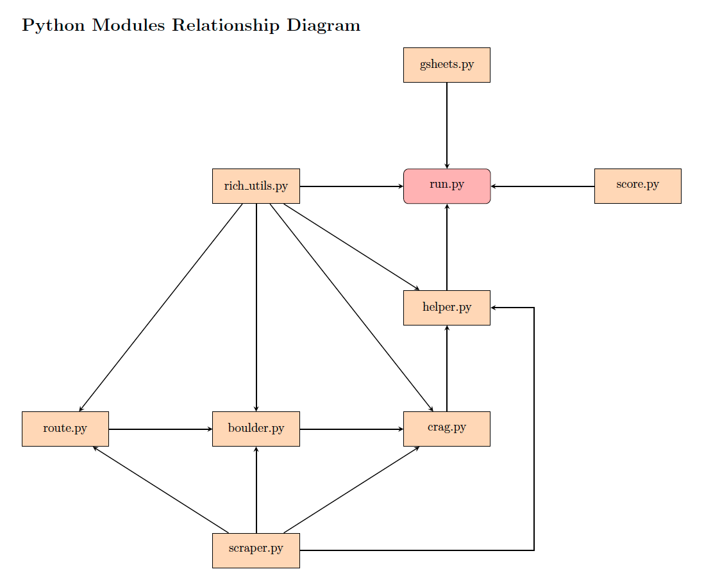

Drilling down further into specific classes, methods and functions:

- Main Functionality
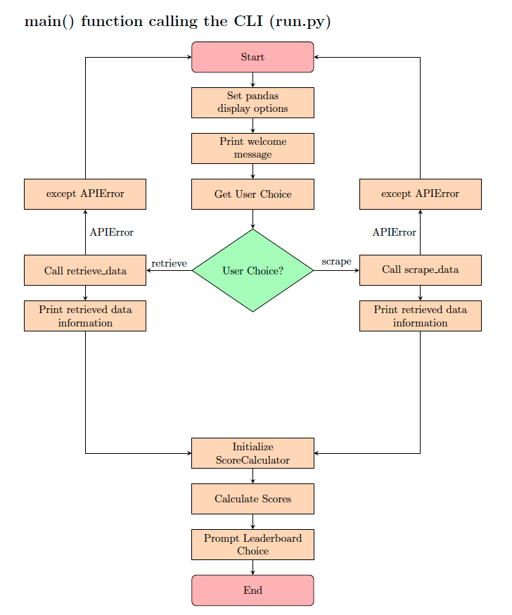

- Google Sheets API Client

- Retrieve / Scrape Functionality
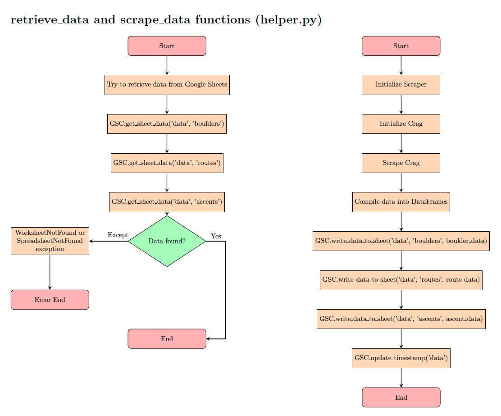

- Scraper Functionality
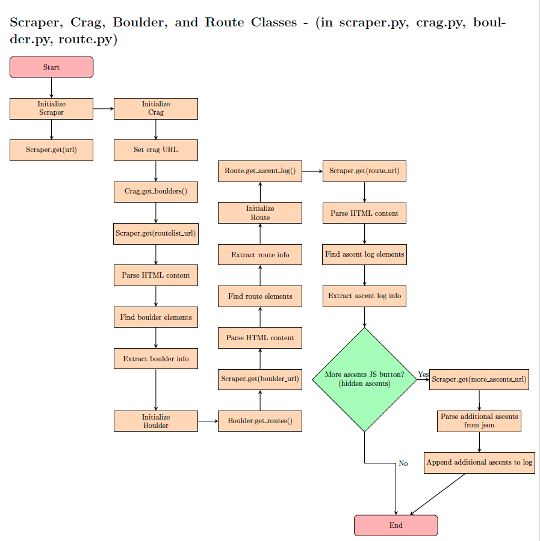

- Score Calculator Class

- Leaderboard Mode Functionality
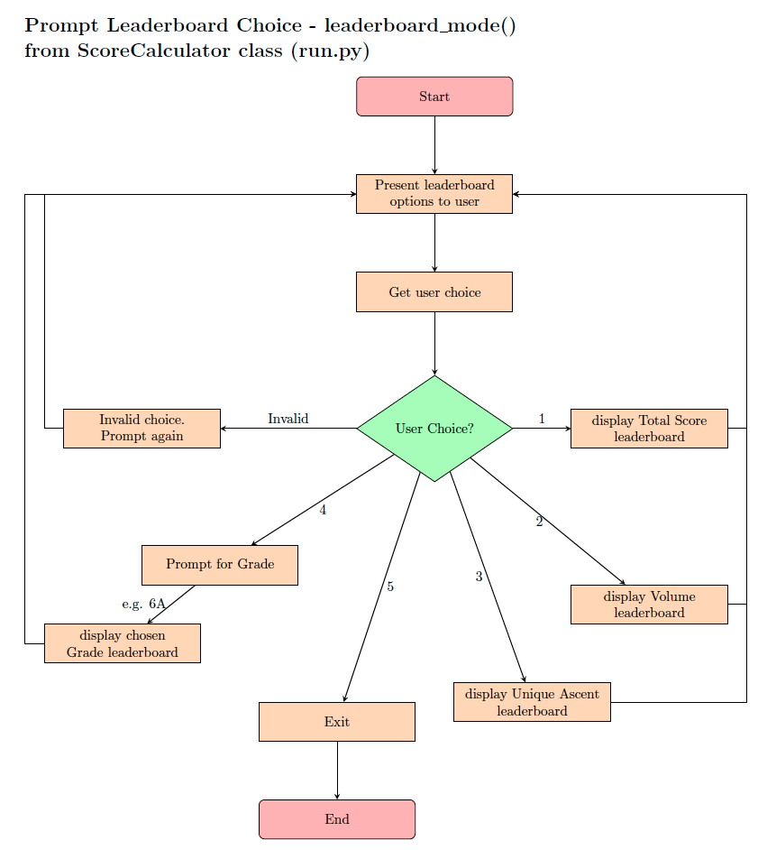

## Design

### Command-line interface (CLI)
The CLI was enhanced with the use of the *rich* python library. We have used the following classes from this library, initialised centrally from the *rich_utils.py* module and passed on to other modules as needed: 
  - **Console class**: Made use of the enhanced print method which allows the use of colour and emphasis. The following colours were used: 
     - Cyan Bold: Welcome and menu messages.
     - Yellow Bold: Progress updates.
     - Red Bold: Error and exiting messages.
     - Green: For the ASCII art welcome graphic.

  - **Progress class**: Creates a visually-appealing progress bar which is used during the running of the scraper to notify the user of progress, which normally takes 2-4 minutes depending on internet speed. A progress instance is initialised in the *rich_utils* module and passed over to the *run.py* file, where it is used with a context manager when the *scrape_data* function is called. The progress instance is used in the *crag.py* module, by adding a task just before looping through the boulder elements. The progress bar is able to estimate a percentage completion and time-to-completion, by reference to the *len* of the boulder elements list and the advancing by one each time it loops through one boulder. An example progress bar is below:
     - 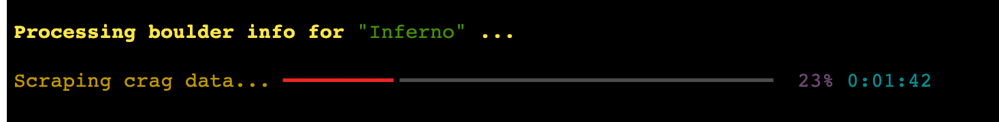

  - **Table class**: Used for displaying the leaderboards in a more visually-appealing table format instead of the simple print method. The *display_table* function was created in the *rich_utils* module which is reused for displaying the leaderboard tables in the *run* module.

  -- **Prompt class**: This class was imported directly to the *run* module, as no modification or initialization was required. The method *ask* was used which is an enhanced *input* method which allows for user prompts with colour options.

Furthermore, the ASCII art title "Crag Leader" on the welcome screen, was created using the python library *pyfiglet* and the font "doom" was chosen. The art was printed with green bold that works well with the black background and cyan bold of the welcome message, adding "electrifying" feel to the welcome screen.

Finally, the terminal was modified slightly with small changes to the adapt to the needs of the application. The column and row sizes were increased in order to prevent the leaderboard tables from being cropped or not displaying optimally.

### Current Features

- **Welcome Screen**:
This includes the first user prompt with choices being to either "scrape" the latest data from the 27crags website or "retrieve" the currently stored data on the google sheets backend. Notice the use of timestamps to notify the user when was the last time the data was updated to help them with their choice. A new timestamp is recorded and stored in the goolge sheet, every time the user scrapes new data.
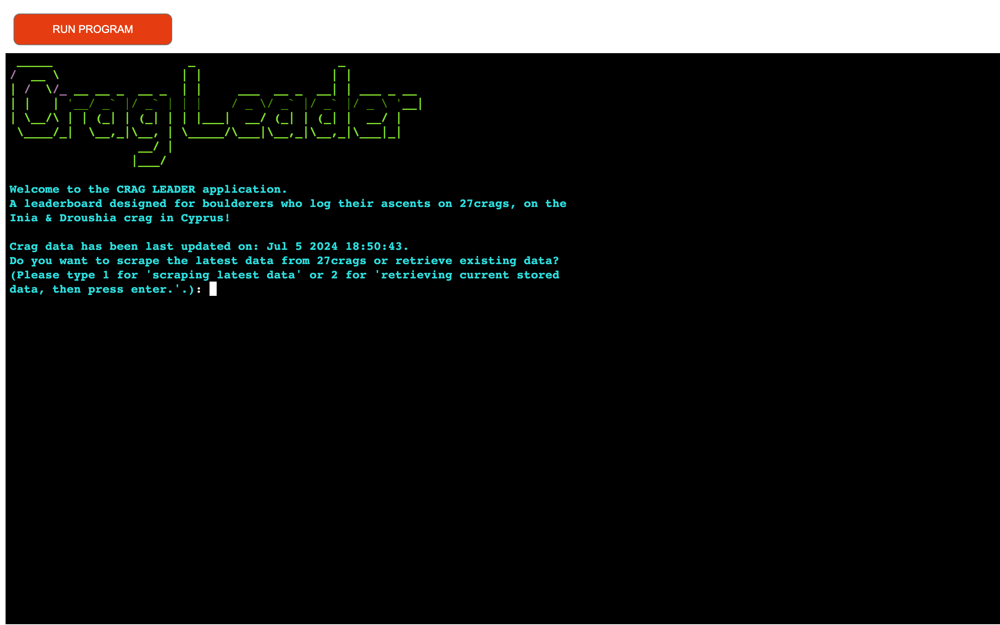

    - Welcome Screen - User input validation:
      - Check for empty string or spaces
      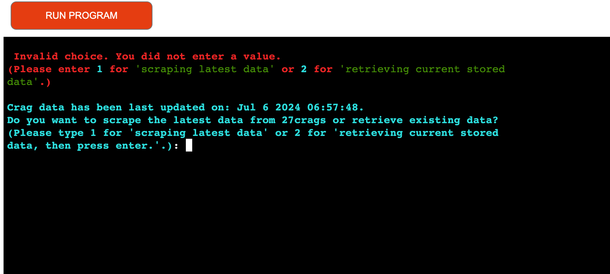
      - Check for invalid number
      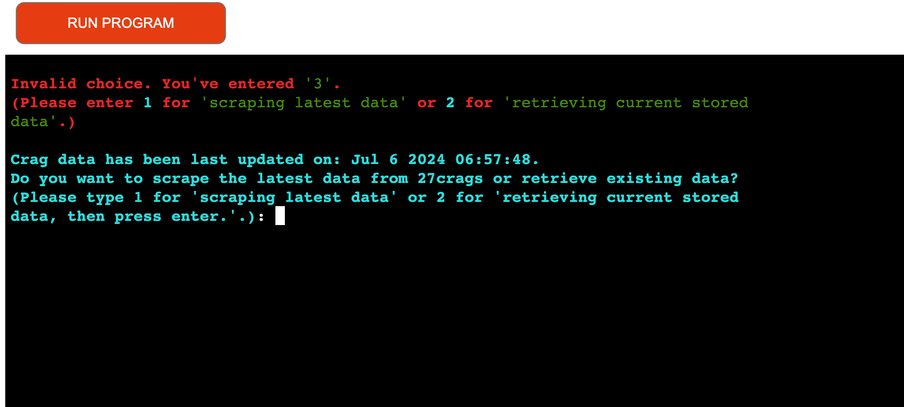
      - Check for invalid text
      

    - User Option - Scrape
      - As already stated above, the scrape option includes the use of a progress bar along with enhanced print statements to provide feedback to the user. Once scraping is done, the scores are calculated and prompts the user for the leaderboard menu choices.
      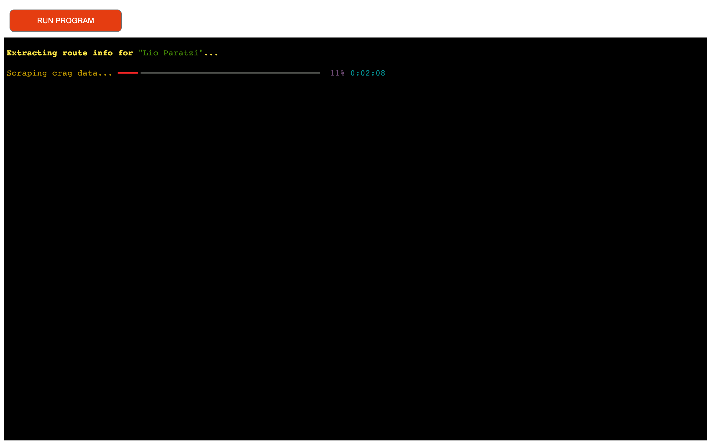
      - Crag, Boulder, Route classes are used along with the Scraper class to organise the information and the relevant methods and attributes following the principled of Object Oriented Programming (OOP). This results in an organised, encapsulated and modular code that models how the crag is structured and organised. This makes it significantly easier to maintain and update in the future, as well as allowing for *Polymorphism* in future releases when a Crag class can be adapted to the needs of Roped Climbing (currently based on Bouldering.)

    - User Option - Retrieve
      - This option is siginificantly faster and retrieves the current data and calculates the scores before prompting for the leaderboard menu.

  - **Leaderboard Menu**:
  This menu appears immediately after the end of processing of either the scraper or retrieve user choices. It provides the following five options and the auxilliary choice for 'help', which explains the options to the user further.
  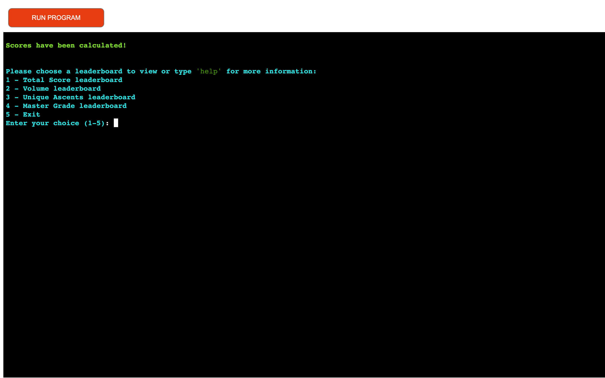

      - User input validation:
        - Check for empty string or spaces
        
        - Check for invalid number
        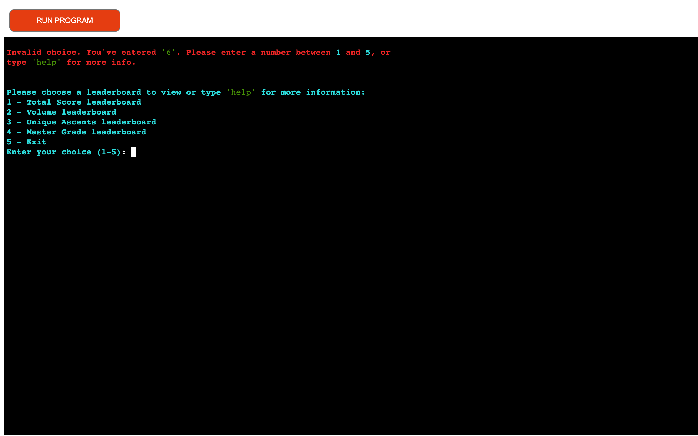
        - Check for invalid text
        

      - Help option:
      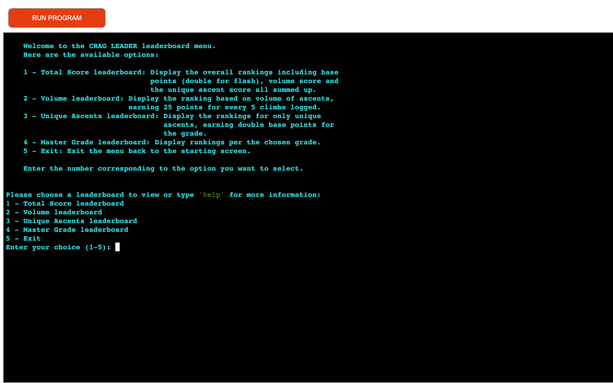

      - Exit option - returns back to the welcome screen

  - **Leaderboards**:
  The leaderboards are created by calculating a scoring table based on the scoring system parameters that are stored in a google sheets input file. A preliminary scoring table is calculated which awards points for each ascent. This table is stored as an attribute to the user-defined *Crag* class and is reused to calculate the Master Grade leaderboard, which requires a further user choice for a specific grade.

  Once the various score components are calculated, the scores are grouped and aggregated by climber as needed in order to give a sum of each score. Note that for the Volume score the *max* aggregate method is used and not *sum*, as it is an overall cumulative score so it shouldn't be summed.

  The *rank_leaderboard* user-defined function, is then used to sort and rank the final table to provide a ranking column. The chosen method for ties is the "min" (an argument of the *rank pandas method*), which means climbers with equal scores share the minimum ranking, so essentially three climbers tied on position 3 will share the rank 3.

     - Total Score leaderboard
       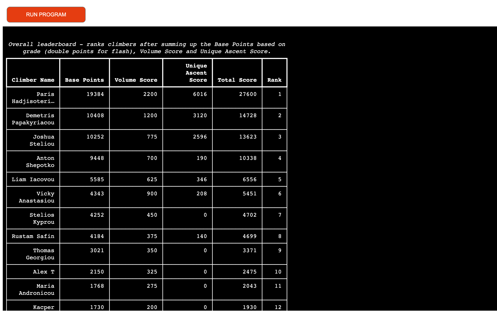
     - Volume leaderboard
       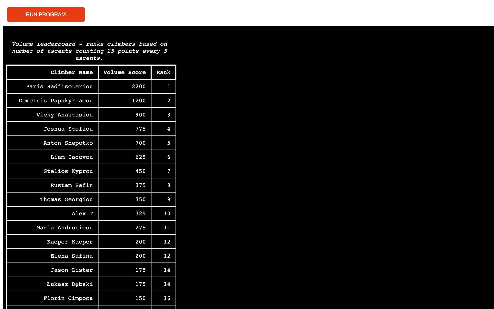
     - Unique Ascents leaderboard
       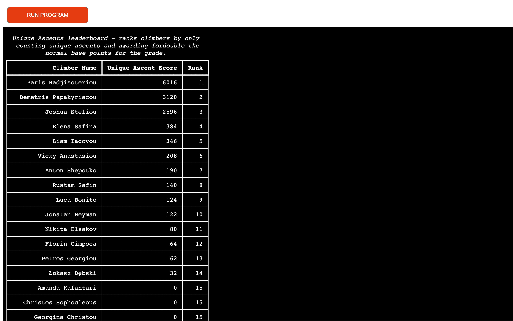
     - Master Grade leaderboard
       - Sub-menu - user input for grade or 0 to return to main leaderboard menu.
       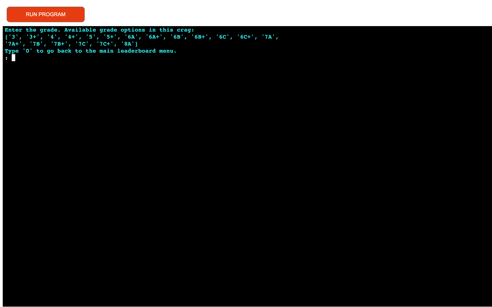
       - Validation for empty string
       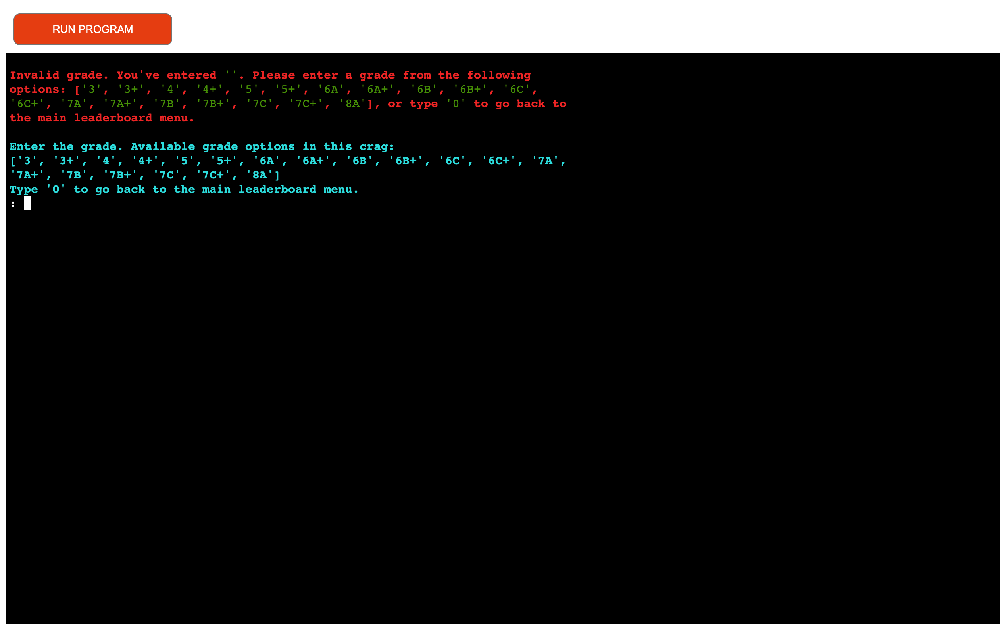
       - Validation for input not in list
       
       - Master Grade leaderboard table
       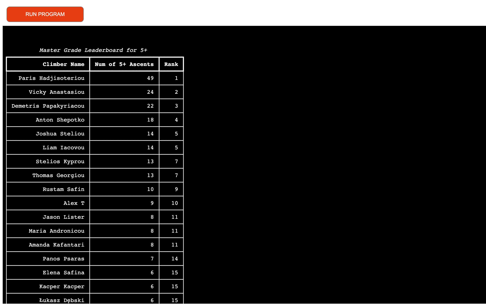

### Future Features
The future features are aligned with the future user goals:
- Expand the Crag class to include methods and attributes around statistics such as Highest grade achieved in Crag by X climber, Median grade climbed etc. Implement this as options to the menus.
- Expand the use of this accross the whole of 27crags available areas and crags, including Sport Climbing and Traditional Climbing areas.
- Allow logging of climbs for available crag routes from the Crag Leader application itself. This might require user-authentication feature as well in order to make it more robust, as currently it relies on the users logging climbs on their account on 27crags.
- Create a user-friendly but simple GUI for the application to enhance the UX.

## Testing
Use-case testing was carried out accross all of the app's CLI options and scenarios imagined. This meant that the code development was impacted by bugs, errors and unwanted UX issues that had to be fixed, as the application evolved and features were added.

### Validator Testing
The code was tested with [PEP8-CI Python Linter](https://pep8ci.herokuapp.com/).
Below are direct access links to the validation of each python module with no issues noted:
  - [boulder.py](https://pep8ci.herokuapp.com/https://raw.githubusercontent.com/dimispapa/crag-leader/main/modules/boulder.py)
  - [crag.py](https://pep8ci.herokuapp.com/https://raw.githubusercontent.com/dimispapa/crag-leader/main/modules/crag.py)
  - [gsheets.py](https://pep8ci.herokuapp.com/https://raw.githubusercontent.com/dimispapa/crag-leader/main/modules/gsheets.py)
  - [helper.py](https://pep8ci.herokuapp.com/https://raw.githubusercontent.com/dimispapa/crag-leader/main/modules/helper.py)
  - [rich_utils.py](https://pep8ci.herokuapp.com/https://raw.githubusercontent.com/dimispapa/crag-leader/main/modules/rich_utils.py)
  - [route.py](https://pep8ci.herokuapp.com/https://raw.githubusercontent.com/dimispapa/crag-leader/main/modules/route.py)
  - [score.py](https://pep8ci.herokuapp.com/https://raw.githubusercontent.com/dimispapa/crag-leader/main/modules/score.py)
  - [scraper.py](https://pep8ci.herokuapp.com/https://raw.githubusercontent.com/dimispapa/crag-leader/main/modules/scraper.py)
  - [run.py](https://pep8ci.herokuapp.com/https://raw.githubusercontent.com/dimispapa/crag-leader/main/run.py)

### Fixed Bugs
- A major bug was detected due to missing a large number of ascents from the scraping process. This was due to the structure of the 27crag website and a limit on the number of ascents showing on a specific Route page. A "More ascents" button in these cases and if clicked, pulls a json file from a URL and recreates the additional ascents that were hidden using JavaScript. I realised this later due to ascent numbers not matching properly. Fixed this by accessing the URL of the json printed file which looked like it contained the same HTML structure as the rest of the webpage, which meant it could be read using the *json* library and then parsed the HTML to scrape the additional ascents in the same way as the other ascents. This meant a separate *get_json_html* method of the Scraper class was created to handle this. A check was also implemented in the *Route* class when processing the parsed HTML, checking for the presence of the "More ascents" button. This step did not work straight away but got it to fully work with commit #f0b4de8.
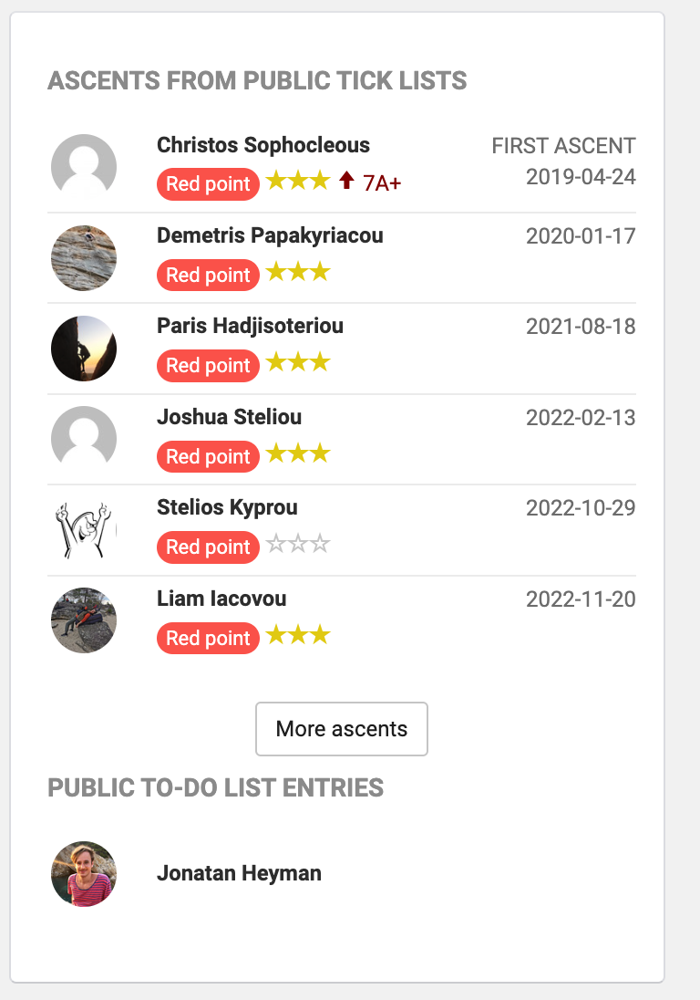
- Further to the above bug, as you can see in the screenshot, there was also sometimes a section with "Public To-Do List Entries" that were not actual ascent logs, so this was causing an *AttributeError* due to not being able to scrape the necessary info that the Route object requires. It was fixed by a *try-except* block and a *continue* statement in the *except* block to skip this to the next iteration. Fixed by commit #c48530d.
- Evaluating all paths in the *get_user_choice* function instead of actual choice path, due to using *if* instead of *elif*. Fixed by commit #143fd1b.
- Issue with the *Progress* class due to contradicting class instances and task sessions, fixed by centralising the initialising of the class in *rich_utils* module and using a context manager to ensure that the progress session is stopped once scraping is done and there isn't a lingering task. Fixed by commit #2242e38.
- The "Climber Name" was not displaying when the leaderboard tables were printed to the terminal while the column headings were also shifted by one. This was due to the dataframe index being set to the "Climber Name" column when the *groupby* method was applied. Fixed by applying the *reset_index* method on the dataframe, within the *display_table* function. Fixed by commit #c6cb359. In addition, the "Climber Name" column heading was not populated at this point when looping through the *dataframe.columns* property, so it was added as an manual step in the *display_table* function. Fixed by commit #82fa7e5.
- The calculation of the master grade table was not functioning correctly as the *calc_master_grade* method of the *ScoreCalculator* class instance was not passed properly in the scope of the *leaderboard_mode* function of the *run* module. Fixed by commit #831a99b.
- After refactoring the *leaderboard_mode* function to use a dictionary to map the user choices to options/paths, this caused a bug which always displayed option 1 for the Total Score leaderboard. This was due to not having a step to filter on the aggregate table to slice only the relevant score columns. Added an *if else* block to handle this. Fixed by commit #9fcee4a.
- Unwanted clearing of the "help" information due to placing the *clear* function call at the top of the *while* loop, effectively clearing the help info before the user has a chance to read it. Moved the clearing call at the beginning of the *show_help* function. Fixed by commit #bfb65af.
- The *BeautifoulSoup4* and *Rich* python libraries (and their associated dependencies) were not added automatically to the *requirements.txt* through the terminal command: *pip3 freeze > requirements.txt*. These were added manually at the bottom of the text file by extracting the required version and names through running the command: *pip3 show [module names]*. This was fixed by commits #bf677f4, #6c80410 and #72c0335.
- A data type issue with the "Grade" column of the *route_data* and *ascent_data* dataframes. The grade values 3, 4, 5 were parsed as *int* by python while in contrast other grades with mixed alphanumeric values, e.g. 6A,  did not have this issue. This meant that when the user's grade choice was used to filter on the dataframe, it would return a blank dataframe as the user choice is always parsed as *str dtype*. Fixed this by making sure that that the "Grade" columns were casted into *str* using the *astype* method. Fixed by commit #dbf2f35.
- The grade was ommitted from the ascent data when compiled into dataframes before writing into the google sheets. Fixed by commit #c01fd93.
- The ranked leaderboard was not sorted in ascending order based on rank. Fixed by commit #48777b5.
- An uknknown potential bug could throw an APIError from *gspread* library. This only occured once when my substitution mentor Tim, tried to initially access the application. On refresh this error went away but the below screenshot indicates the error. To handle the scenario of this happening again, a *try-except* block was added around the call of the *main* function, which notifies the user of the error and attemtps to run *main* again after a *sleep* of 3 seconds.
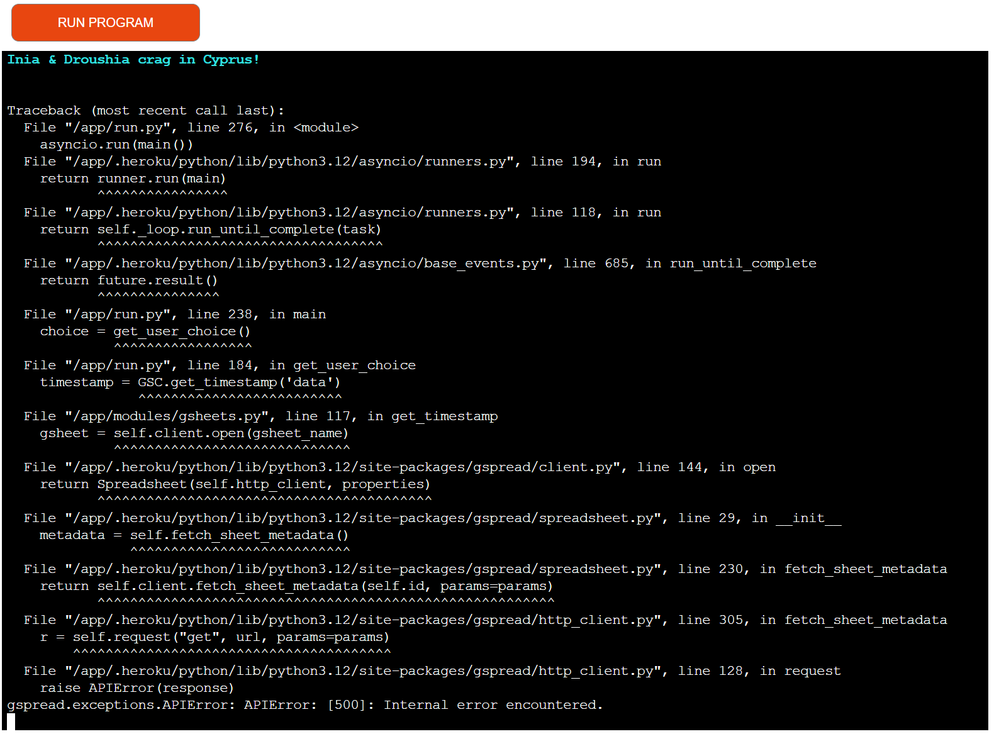

### Unfixed Bugs
- A very minor bug is that the leaderboard tables displayed do not clear if you scroll up and check. On discussion with mentor Tim, understood that this is a known bug on Heroku deployed apps that it can only clear the visible terminal area. Do to the tall size of the tables, this means they linger out of sight without being cleard, in case you scroll back up. This is not a major UX issue as it is not visible to the user and the upside is that the user can refer back to the tables previously selected without having to reselect them.

## Technologies Used

### Main Programming Languages used
- **[Python 3.12.2](https://www.python.org/)**

### Third-party Python Modules used
- **pandas**: for operations on dataframes and data processing on scraped data.
- **rich**: for enhancing the command-line operations and interface.
- **gspread**: for creating an autherised client to interact, fetch and write to google sheets.
- **gspread_dataframe**: use the set_with_dataframe method to write a dataframe directly to a google sheet.
- **time**: use the sleep method to introduce itentional delay for UX purposes and controlling the execution were needed.
- **google.oauth2.service_account**: authenticate to use the google cloud services and access the google drive location.
- **datetime**: to handle and create timestamps for the data stored.
- **os**: to use for the clear function clearing the terminal.
- **pyfiglet**: for creating the welcome title in ASCII art format.
- **beautifulsoup4**: for scraping the webpage, parsing the HTML into a soup object and navigating the element structure, targetting elements as needed.
- **requests**: for handling HTTP requests to the URLs for scraping using the response object.
- **json**: used to read files in json format.

### Tools
- **Heroku** for live deployment of a python-based CLI application.
- **GitHub** for version control, pushing code changes from Git and safe storage of the codebase.
- **Gitpod Enterprise** to create the workspace from the GitHub repository with the necessary project files.
- **VS-Code Desktop**: The IDE used to write Python code and manage the workspace files. Connected to the Gitpod Enterprise workspace via remote connection. Useful extensions were used such as Python, PEP8 linters etc.
- **Overleaf**: for creating the process-flow diagrams used in the readme.
- **Chatgpt** was used to create the image at the start of the readme, general queries regarding code and helping to write docstrings rapidly.

## Deployment
- The app was deployed via the Heroku Cloud platform.
- Git commits and push were executed via the VS Code Desktop IDE, through the Source Control ribbon which allow easier management of Git operations.
- The required libraries were installed in the virtual environment of the Gitpod workspace through the VS Code terminal, when connected to the workspace. These were included in the requirements.txt file for the deployment to Heroku to work properly.

### How to deploy

  - Log in to Heroku.
  - Create a new application in Heroku.
  - Select "New" and then "Create new app".
  - Name the app, choose a region, and click "Create app".
  - Navigate to the "Settings" tab at the top.
  - In the "Reveal Config Vars" section, enter the following details:
    KEY: PORT, VALUE: 8000.
  - In the buildpacks section, click "Add buildpack".
  - Choose Python and Node.js, ensuring this order is maintained.
  - Go to the "Deploy" tab at the top.
  - Under "Deployment Method", select "GitHub" to connect the two.
  - Click "Connect" to link to the desired GitHub repository.
  - Enable "Automatic Deploys".
  - Heroku will then begin deploying your app.
  - Subsequent deployments were handled automatically whenever changes were pushed to GitHub.

### How to clone

- Navigate to this GitHub repository: https://github.com/dimispapa/crag-leader
- Click on the 'Code' button at the top right, then select 'HTTPs'.
- Copy the URL provided.
- Open VS Code, create a new project folder, and open the terminal.
- In the terminal, type "git clone", paste the copied URL, and press 'Enter'.
- This will start the cloning process.

### Credits
- **Code Institute** - Full Stack Developer Course: Python material and Love-Sandwiches walkthrough.
- [Geeksforgeeks.org](https://www.geeksforgeeks.org/): Helping to understand various python methods/concepts, including but not limited to: 
  - Use BeautifoulSoup for scraping
  - how to use the pandas.apply() method on dataframes using a secondary function
  - how to target certain HTML tags/elements when scraping
  - how to use .groupby() with .size() to count for ascents
  - how to use the .rank() method
  - how to concert a string to datetime object and vice versa
- [Deviceatlas.com](https://deviceatlas.com/device-data/user-agent-tester): To ensure that a proper HEADER attribute is used on the HTTP requests, to avoid potential issues with variability in browser rendering when scraping.
- [Medium.com](https://medium.com/): Helping to expand knowledge on Python concepts around OOP and other useful tips and tricks.
- [Arjancodes.com](https://arjancodes.com/blog/rich-python-library-for-interactive-cli-tools/): A useful article on the use of the rich library for CLI design.
- [Digital ocean.com](https://www.digitalocean.com): Help on the use of the __repr__ method for classes.
- My primary mentor Rory Patrick Sheridan for the use of his code snippet for the function clear().
- My substitution mentor Tim for his guidance and help to wrap up the project as well as recommending the use of mermaid interactivity for flowcharts that did not have time to implement.

## Acknowledgements
- I want to express my gratitude to my mentors Rory Patrick Sheridan and Tim for the valuable help, guidance, useful tips and reviewing/testing my work.
- I also want to thank my girlfriend Georgina and my friend Stelios, for using the app and providing feedback.
- Thanks to Deloitte for my past experience and training using Python.

## Changelog

### Version 1.1.0 (2025-03-12)
#### Added
- Automated login functionality for 27crags.com
- Rate limiting for web scraping (1 request/second)
- Environment variable support for credentials

#### Changed
- Improved error handling for API requests
- Updated documentation for authentication setup

#### Fixed
- Various scraping reliability improvements

### Version 1.0.0 (Initial Release - 2024-11-11)
- Initial release of Crag Leader
- Basic scraping functionality
- Leaderboard system
- Google Sheets integration