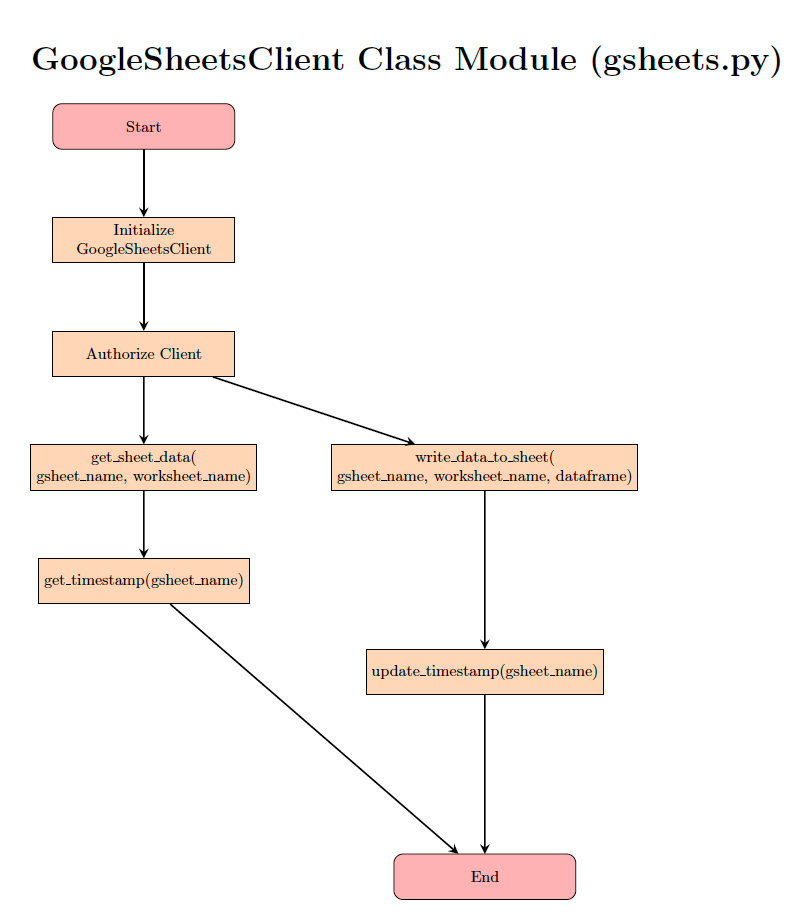
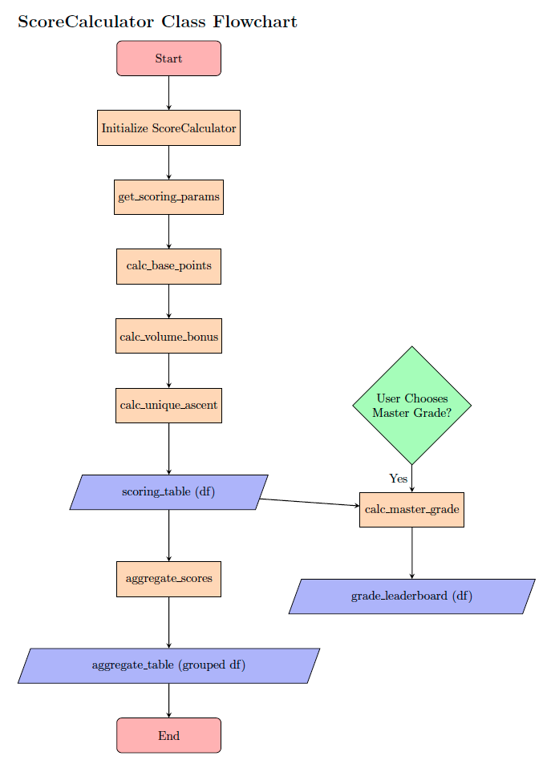

<h1 align="center">CRAG LEADER - Bouldering Leaderboard CLI app</h1>

"Crag Leader" is an application built on a command-line interface, with the purpose of scraping climbing logs from a widely used online platform called [27crags](https://27crags.com/crags/inia-droushia/).

 

This app aims to process the scraped information and it is capable of displaying a number of leaderboards depending on the chosen criteria (overall, volume, unique ascent etc.), with a pre-defined scoring system. The current prototype version is focused on my local bouldering crag in Inia & Droushia of Cyprus but wider use of the app on other crags of the same platform is possible with some minor adjustments.

<a href="https://crag-leader-a9343167f108.herokuapp.com/">ACCESS THE APPLICATION</a>

 

## UX

### App Purpose

This application was designed with the purpose of presenting the user with various leaderboards based on scraped or stored data from the 27crags online climbing platform.

### App Goals

- Gamify climbing and bouldering by generating friendly competition between climbers and increase motivation for climbing and maintaining an online log.
- Allow climbers to have visibility of their standings, progress and the levels accross the community.

### Audience

Narrow audience of climbers actively using the 27crags platform and specifically for climbers who log climbs at the Inia & Droushia crag in Cyprus.

### Communication

The application interacts with the user via prompts and print statements in the terminal. The user is presented with various choices and is asked to input their choices in the terminal.

UX is improved through the use of colour and progress bars, to communicate information in a clearer and more visually appealing manner.

### Current User Goals

- Scrape latest ascent data or fetch currently stored data for a faster loading time. The decision is to be made based on the last updated date.
- Present leaderboard rankings based on the chosen criteria.

### Future User Goals

- Provide another menu with options with interesting statistics about the crag, boulders, routes and ascents.
- Increase the audience by allowing logging of climbs via the CRAG LEADER app directly, while maintaining the capability to scrape data from 27crags, in order to allow both users and non-users of "27crags" to use CRAG LEADER.
- Increase the audience by allowing the choice of crag on start, in order to expand usage to all crags available on the "27crags" platform. This will also expand the usage to Sport Climbing or Traditional Climbing, other than just Bouldering.

## Logic

### Process Flow Diagrams

The following flowcharts were created using [Overleaf](https://www.overleaf.com/) to visualise the logical flow of the application.

- The structure and relationship between the user-created python modules reached its current state, as a result of continuous refactoring of code as the application grew and developed. Breaking it down into smaller and related elements of classes, functions and modules as the application was getting bigger, made it easier to reuse, debug, test and maintain.

Drilling down further into specific classes, methods and functions:

- Main Functionality

- Google Sheets API Client

- Retrieve / Scrape Functionality

- Scraper Functionality

- Score Calculator Class

- Leaderboard Mode Functionality

## Design

### Command-line interface (CLI)
The CLI was enhanced with the use of the *rich* python library. We have used the following classes from this library, initialised centrally from the *rich_utils.py* module and passed on to other modules as needed: 
  - **Console class**: Made use of the enhanced print method which allows the use of colour and emphasis. The following colours were used: 
     - Cyan Bold: Welcome and menu messages.
     - Yellow Bold: Progress updates.
     - Red Bold: Error and exiting messages.
     - Green: For the ASCII art welcome graphic.

  - **Progress class**: Creates a visually-appealing progress bar which is used during the running of the scraper to notify the user of progress, which normally takes 2-4 minutes depending on internet speed. A progress instance is initialised in the *rich_utils* module and passed over to the *run.py* file, where it is used with a context manager when the *scrape_data* function is called. The progress instance is used in the *crag.py* module, by adding a task just before looping through the boulder elements. The progress bar is able to estimate a percentage completion and time-to-completion, by reference to the *len* of the boulder elements list and the advancing by one each time it loops through one boulder. An example progress bar is below:
     - 

  - **Table class**: Used for displaying the leaderboards in a more visually-appealing table format instead of the simple print method. The *display_table* function was created in the *rich_utils* module which is reused for displaying the leaderboard tables in the *run* module.

  -- **Prompt class**: This class was imported directly to the *run* module, as no modification or initialization was required. The method *ask* was used which is an enhanced *input* method which allows for user prompts with colour options.

Furthermore, the ASCII art title "Crag Leader" on the welcome screen, was created using the python library *pyfiglet* and the font "doom" was chosen. The art was printed with green bold that works well with the black background and cyan bold of the welcome message, adding "electrifying" feel to the welcome screen.

Finally, the terminal was modified slightly with small changes to the adapt to the needs of the application. The column and row sizes were increased in order to prevent the leaderboard tables from being cropped or not displaying optimally.

### Current Features

- **Welcome Screen**:
This includes the first user prompt with choices being to either "scrape" the latest data from the 27crags website or "retrieve" the currently stored data on the google sheets backend. Notice the use of timestamps to notify the user when was the last time the data was updated to help them with their choice. A new timestamp is recorded and stored in the goolge sheet, every time the user scrapes new data.

    - Welcome Screen - User input validation:
      - Check for empty string or spaces
      
      - Check for invalid number
      
      - Check for invalid text
      

    - User Option - Scrape
      - As already stated above, the scrape option includes the use of a progress bar along with enhanced print statements to provide feedback to the user. Once scraping is done, the scores are calculated and prompts the user for the leaderboard menu choices.
      
      - Crag, Boulder, Route classes are used along with the Scraper class to organise the information and the relevant methods and attributes following the principled of Object Oriented Programming (OOP). This results in an organised, encapsulated and modular code that models how the crag is structured and organised. This makes it significantly easier to maintain and update in the future, as well as allowing for *Polymorphism* in future releases when a Crag class can be adapted to the needs of Roped Climbing (currently based on Bouldering.)

    - User Option - Retrieve
      - This option is siginificantly faster and retrieves the current data and calculates the scores before prompting for the leaderboard menu.

  - **Leaderboard Menu**:
  This menu appears immediately after the end of processing of either the scraper or retrieve user choices. It provides the following five options and the auxilliary choice for 'help', which explains the options to the user further.
  

      - User input validation:
        - Check for empty string or spaces
        
        - Check for invalid number
        
        - Check for invalid text
        

      - Help option:
      

      - Exit option - returns back to the welcome screen

  - **Leaderboards**:
  The leaderboards are created by calculating a scoring table based on the scoring system parameters that are stored in a google sheets input file. A preliminary scoring table is calculated which awards points for each ascent. This table is stored as an attribute to the user-defined *Crag* class and is reused to calculate the Master Grade leaderboard, which requires a further user choice for a specific grade.

  Once the various score components are calculated, the scores are grouped and aggregated by climber as needed in order to give a sum of each score. Note that for the Volume score the *max* aggregate method is used and not *sum*, as it is an overall cumulative score so it shouldn't be summed.

  The *rank_leaderboard* user-defined function, is then used to sort and rank the final table to provide a ranking column.

     - Total Score leaderboard
       
     - Volume leaderboard
       
     - Unique Ascents leaderboard
       
     - Master Grade leaderboard
       - Sub-menu - user input for grade or 0 to return to main leaderboard menu.
       
       - Validation for empty string
       
       - Validation for input not in list
       
       - Master Grade leaderboard table
       

### Future Features
The future features are aligned with the future user goals:
- Expand the Crag class to include methods and attributes around statistics such as Highest grade achieved in Crag by X climber, Median grade climbed etc. Implement this as options to the menus.
- Expand the use of this accross the whole of 27crags available areas and crags, including Sport Climbing and Traditional Climbing areas.
- Allow logging of climbs for available crag routes from the Crag Leader application itself. This might require user-authentication feature as well in order to make it more robust, as currently it relies on the users logging climbs on their account on 27crags.
- Create a user-friendly but simple GUI for the application to enhance the UX.

## Testing
Use-case testing was carried out accross all of the app's CLI options and scenarios imagined. This meant that the code development was impacted by bugs, errors and unwanted UX issues that had to be fixed, as the application evolved and features were added.

### Validator Testing
- The code was tested with [PEP8-CI Heroku-App](https://pep8ci.herokuapp.com/).
Below are direct access links to the validation of each python module:
  - [boulder.py](https://pep8ci.herokuapp.com/https://raw.githubusercontent.com/dimispapa/crag-leader/main/modules/boulder.py)
  - [crag.py](https://pep8ci.herokuapp.com/https://raw.githubusercontent.com/dimispapa/crag-leader/main/modules/crag.py)
  - [gsheets.py](https://pep8ci.herokuapp.com/https://raw.githubusercontent.com/dimispapa/crag-leader/main/modules/gsheets.py)
  - [helper.py](https://pep8ci.herokuapp.com/https://raw.githubusercontent.com/dimispapa/crag-leader/main/modules/helper.py)
  - [rich_utils.py](https://pep8ci.herokuapp.com/https://raw.githubusercontent.com/dimispapa/crag-leader/main/modules/rich_utils.py)
  - [route.py](https://pep8ci.herokuapp.com/https://raw.githubusercontent.com/dimispapa/crag-leader/main/modules/route.py)
  - [score.py](https://pep8ci.herokuapp.com/https://raw.githubusercontent.com/dimispapa/crag-leader/main/modules/score.py)
  - [scraper.py](https://pep8ci.herokuapp.com/https://raw.githubusercontent.com/dimispapa/crag-leader/main/modules/scraper.py)
  - [run.py](https://pep8ci.herokuapp.com/https://raw.githubusercontent.com/dimispapa/crag-leader/main/run.py)
